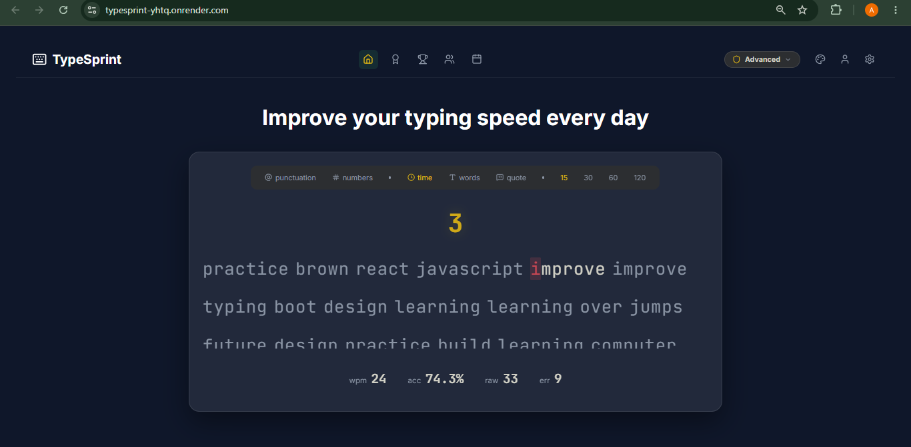
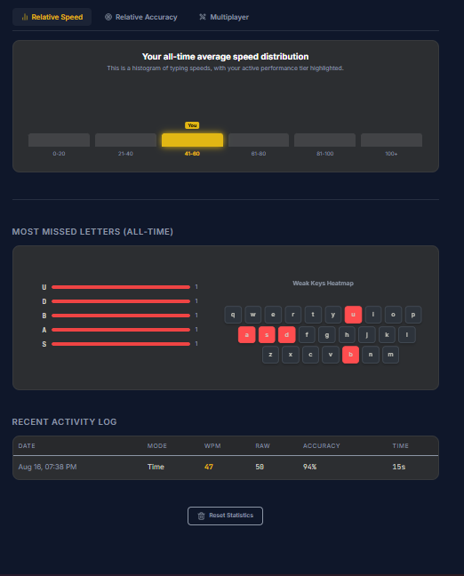
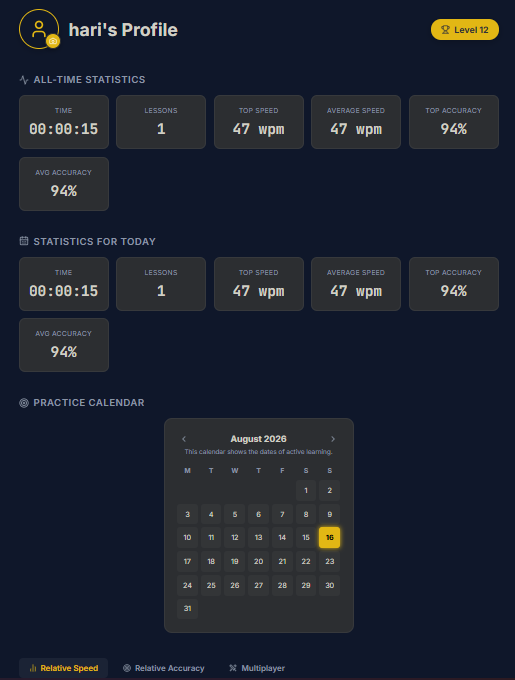

# TypeSprint ⌨️🚀

TypeSprint is a feature-rich, full-stack typing speed test application designed to help developers and typists improve their speed, accuracy, and muscle memory. 

Featuring real-time ghost racing, dynamic custom modifiers, and comprehensive statistics tracking, TypeSprint offers a highly customizable typing experience.

## ✨ Features

* **Multiple Game Modes:** Practice by Time (15s, 30s, 60s, 120s), Word Count (10, 25, 50, 100), or type famous developer Quotes.
* **Ghost Racing:** Compete against your own previous best WPM (Words Per Minute) with a visual ghost marker traversing the text.
* **Custom Modifiers:** Adjust sliders to inject dynamic punctuation and numbers into the word bank to simulate real-world coding and typing scenarios.
* **Real-time Analytics:** Tracks live WPM, Raw WPM, Accuracy, keystroke logs, and missed keys.
* **User Authentication:** Secure signup and login to persist global statistics and test history across sessions.
* **Interactive UI:** Features custom themes, sound effects, and a responsive typing viewport.

---

## 📸 App Previews

| Home Screen | Result Screen | User Profile 1 | User Profile 2 |
| :---: | :---: | :---: | :---: |
|  |  |  |  |

## 🛠️ Tech Stack

**Frontend**
* React.js (Hooks: `useState`, `useEffect`, `useRef`)
* CSS3 (Custom responsive styling and animations)
* Axios / Fetch API

**Backend**
* Java 17
* Spring Boot (v3.5.6)
* Spring Data JPA / Hibernate
* RESTful APIs & CORS Configuration

**Database & Deployment**
* PostgreSQL
* Hosted on [Render](https://render.com/)

---

## 🚀 Getting Started (Local Development)

To get a local copy up and running, follow these simple steps.

### Prerequisites
* [Node.js](https://nodejs.org/) (v16+)
* [Java JDK 17](https://www.oracle.com/java/technologies/javase/jdk17-archive-downloads.html)
* [PostgreSQL](https://www.postgresql.org/) (Installed locally)
* [Maven](https://maven.apache.org/)

### 1. Backend Setup (Spring Boot)

1. Clone the repository and navigate to the backend folder:
   ```bash
   git clone [https://github.com/AmbarMishra973/typesprint.git](https://github.com/AmbarMishra973/typesprint.git)
   cd typesprint/backend
   ```
2. Create a local PostgreSQL database named `typesprintdb`.
3. Update your `src/main/resources/application.properties` to connect to your local database:
   ```properties
   spring.datasource.url=jdbc:postgresql://localhost:5432/typesprintdb
   spring.datasource.username=postgres
   spring.datasource.password=your_local_password
   spring.jpa.hibernate.ddl-auto=update
   ```
4. Run the Spring Boot application:
   ```bash
   mvn spring-boot:run
   ```
   *The backend will start on `http://localhost:8080`*

### 2. Frontend Setup (React)

1. Navigate to the frontend directory:
   ```bash
   cd ../frontend
   ```
2. Install dependencies:
   ```bash
   npm install
   ```
3. Update your API configuration in `src/services/api.js` to point to your local backend:
   ```javascript
   const API_BASE_URL = "http://localhost:8080/api";
   ```
4. Start the development server:
   ```bash
   npm start
   ```
   *The frontend will start on `http://localhost:3000`*

---

## 🌍 Production Deployment

This project is configured for cloud deployment.

**Backend (Render):**
* Ensure your Render Web Service has the following Environment Variables configured securely:
  * `SPRING_DATASOURCE_URL`
  * `SPRING_DATASOURCE_USERNAME`
  * `SPRING_DATASOURCE_PASSWORD`
* Ensure your Spring Boot `application.properties` uses placeholder syntax (e.g., `${SPRING_DATASOURCE_URL}`) to read these variables.

**Frontend:**
* Update the `API_BASE_URL` to point to your live Render backend URL before deploying (e.g., `https://your-backend.onrender.com/api`).
* Ensure your Spring Boot backend has a Global CORS Configuration allowing requests from your frontend domain.

---

## 📂 Project Structure

```text
typesprint/
├── backend/                   # Spring Boot application
│   ├── src/main/java/...      # Controllers, Models, Repositories, Services
│   └── src/main/resources/    # application.properties
│
└── frontend/                  # React application
    ├── public/                # index.html, assets
    └── src/
        ├── components/        # TypingBox, TypingViewport, Stats, etc.
        ├── hooks/             # Custom useTypingEngine logic
        ├── styles/            # CSS stylesheets
        └── utils/             # API services and local storage handlers
```

---

## 🤝 Feedback & Issues

TypeSprint is a personal portfolio project. As such, **external Pull Requests are currently closed**, and only authorized contributors can push code changes.

However, feedback from the community is highly appreciated! If you encounter a bug, have a feature suggestion, or experience any issues while using the application, you are more than welcome to raise an issue:

1. Go to the [Issues page](https://github.com/your-username/typesprint/issues).
2. Click on **New Issue**.
3. Provide a clear description of the bug or your feature request.
